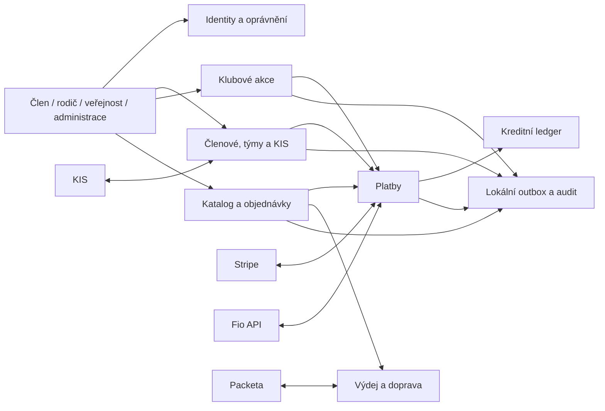

# 03 – Cílová architektura

## Architektonický směr

Pro první etapy doporučujeme **modulární monolit** v Evidence. Nasazuje se jako
jeden celek na současný hosting, ale každá doména vlastní své tabulky, služby a
stavové přechody. Externí systémy jsou připojené přes adaptéry.

## Vlastnictví domén

| Doména | Vlastní | Nevlastní |
|---|---|---|
| identity | účty, ověření, session, vazby účet–osoba, souhlasy | sportovní profil a peníze |
| členové/KIS | osoby, rodiny, členství, sezóny, týmy, soupisky, KIS external ID | login a objednávky |
| klubové akce | akce, kapacity, přihlášky, čekací listina, storno pravidla | účetní `ucto_udalosti` |
| shop | katalog, varianty, ceny, košík, kupóny, objednávky, sklad | skutečnost, zda byla platba přijata |
| payments | payment intent, pokus, provider event, bankovní pohyb, refund | obsah objednávky |
| wallet | účty a neměnné kreditní pohyby | Stripe webhook nebo sklad |
| fulfillment | osobní výdej, zásilka, tracking | stav platby |
| integrations | vstupy/výstupy, outbox, retry, dead-letter a korelační ID | doménová rozhodnutí |

## Identita a rodinné vztahy

Evidence je samostatná aplikace a pro klubové MVP vlastní své účty, session,
role i vazby na osoby. Velocota není zdroj členských, shopových, platebních ani
provozních dat. Výhledově lze samostatně navrhnout sdílenou/federovanou identitu
uživatele, ale bez sdílené cookie, přímého zápisu do cizích aplikačních tabulek
nebo rozšiřování integrace do dalších domén.

Doporučený minimální model:

- `public_accounts` nebo rozšířené `verejni_uzivatele` – přihlašovací účet,
- `people`/stávající `sportovci` – evidovaná fyzická osoba,
- `account_person_roles` – vazba účet ↔ osoba, role (`self`, `guardian`) a
  platnost,
- `guardian_approvals` – kdo a jak vazbu schválil,
- `account_verifications` – hashovaný jednorázový token, účel a expirace.

Claim účtu je řízený proces: žádné automatické propojení jen podle e-mailu. Pro
budoucí centrální login se použije krátkodobý jednorázový autorizační kód a
server-to-server výměna, ne čtení cizí session cookie.

## KIS a členský model

Současný staged import lze zachovat, ale nejprve je nutné opravit chybu v
`includes/kis_match_lib.php:43-92`: statická cache kandidátů se při každém
hledání zmenšuje. Každý importovaný člověk musí být porovnáván proti celé
nezměněné množině kandidátů a tato vlastnost musí mít regresní test.

Nový kanonický model má obsahovat nejméně:

- stabilní `external_system` + `external_id`,
- členství s platností a stavem,
- sezóny, týmy a `roster_memberships` s intervalem platnosti,
- kontakty a adresy s původem a časem posledního ověření,
- finanční předpisy oddělené od bankovních transakcí,
- importní raw data, návrh změn, explicitní schválení a historii,
- exportní snapshot a paritní report pro cutover.

Přechod proběhne jako `stage → validate → match → explicit promote → parity
report`. Chybějící osoba se nearchivuje automaticky. KIS zůstane zdrojem pravdy,
dokud vlastník produktu neschválí cutover podle brány v dokumentu 04.

## Klubové akce

Nové `club_events` nesmí přetížit stávající účetní `ucto_udalosti`.

Navržené entity:

- `club_events`, `club_event_targets`, `club_event_prices`,
- `club_event_registrations`, `club_event_participants`,
- `club_event_consents`, `club_event_status_history`.

Přihláška má stavový automat:

`draft → pending_payment / confirmed / waitlisted → cancelled → refunded`

Kapacita a posun z čekací listiny musí být transakční. U nezletilého je
přihlašovatel účet rodiče a účastník dítě; obě identity se nikdy neslévají.

## E-shop

Minimální entity:

- `shop_products`, `shop_variants`, `shop_prices`, `shop_inventory_movements`,
- `shop_carts`, `shop_cart_items`,
- `shop_coupons`, `shop_coupon_redemptions`,
- `shop_orders`, `shop_order_items`, `shop_order_status_history`,
- `shop_fulfillments` a později `shop_shipments`.

Objednávka ukládá snapshot názvu, SKU, ceny, sazby daně a slevy. Pozdější změna
produktu proto nepřepíše historii. Stav objednávky je oddělený od platby:

- objednávka: `draft → placed → processing → ready/shipped → completed`, případně
  `cancelled`,
- platba: `created → pending → paid`, případně `failed`, `cancelled`, `refunded`,
- výdej/zásilka: `not_required/pending → ready → handed_over/shipped → delivered`.

Import ze Shoptetu je opakovatelný dry-run podle stabilního SKU. Neznámé nebo
duplicitní SKU se nepřepisuje automaticky; skončí v konfliktním reportu.

## Platby a kredit

### Platební vrstva

Každý platební účel používá společné objekty `payments`, `payment_attempts`,
`provider_events`, `bank_transactions` a `refunds`. Vazba `payable_type` +
`payable_id` směřuje na objednávku, registraci, členský předpis nebo dobití.

Zásady:

- cenu vždy počítá server z kanonických dat,
- částka je integer v haléřích a má ISO měnu,
- Stripe webhook se ověřuje podpisem a deduplikuje podle event ID,
- návrat z platební stránky nikdy sám nepotvrdí zaplacení,
- Fio pohyb se přijme právě jednou podle jeho ID; nepřiřazený pohyb čeká na ruční
  frontě,
- každá změna stavu proběhne v DB transakci a následná práce jde do outboxu.

### Kreditní ledger

Zůstatek není ručně editovatelný sloupec. Je součtem neměnných položek v
`wallet_entries`, seskupených do účtů a transakcí. Minimálně rozlišujeme:

- `reward` – klubová odměna za účast,
- `cash` – hodnota získaná peněžním dobitím.

Každý pohyb má účet, částku, typ hodnoty, referenci na zdroj, idempotency key,
čas, autora a případný vyrovnávací pohyb. Rezervace prostředků při checkoutu je
oddělená od finálního čerpání. Smíšení obou kapes nebo vratka peněžního dobití
se povolí až po účetním a právním rozhodnutí.

## Integrace a asynchronní práce

Evidence používá vlastní DB outbox pro své skutečné externí integrace. Worker/cron
vybírá nezpracované události, zvyšuje počet pokusů a po limitu je přesune do
administrátorské fronty. Každý consumer je idempotentní.

| Systém | Směr | Kontrakt |
|---|---|---|
| KIS | import + dočasný export | versionovaný soubor/API, raw archiv, external ID, paritní report |
| Shoptet | import | CSV/XLSX/XML, stabilní SKU, dry-run a konflikt report |
| Stripe | obousměrně | Checkout Session + podepsané webhooky + event dedup |
| Fio | příjem | cursor/date window, transaction ID, VS/částka/měna, bezpečný retry |
| Packeta | obousměrně | pickup-point feed + shipment adapter, test sender |

Velocota v této tabulce záměrně není. Případné budoucí sdílení uživatelské
identity je samostatná IAM otázka, nikoli obecná integrační cesta.

## Migrace a konzistence

Request-time `auto_migrace.php` se nemá dál rozšiřovat o celý finanční systém.
Foundation vytvoří číslované migrace a tabulku migračního ledgeru. Každá migrace
má preflight, forward krok, post-check a popsaný rollback nebo forward-fix.

Nasazovací pořadí je `záloha → kód kompatibilní se starým schématem → migrace →
post-check → aktivace feature flagu`. Destruktivní změny používají expand/contract
ve více verzích. Obnova zálohy se pravidelně prakticky testuje.

## Bezpečnostní hranice

- před e-shopem aktualizovat zranitelné knihovny, zvlášť parser XLS/XLSX,
- převést všechna legacy plaintext hesla řízeným způsobem a vynutit bezpečné
  cookie/session parametry, rate limit a reset hesla,
- používat CSRF pro stavové webové operace; potvrzení přes e-mail má expirovaný
  hashovaný token a bezpečný jednorázový přechod,
- produkční tajemství pouze v hostingu/GitHub Secrets, nikdy v repozitáři ani v
  logu či běžné URL,
- oddělit oprávnění trenéra, členské evidence, financí, skladu a podpory,
- auditovat export osobních dat, přístup k nezletilým a ruční finanční zásahy.
