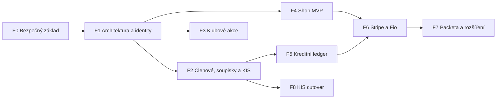

# 04 – Roadmapa a brány

> **Aktualizace 3. 8. 2026:** Pro nejbližší produktovou práci má přednost
> [08 – Milník M1](08-milnik-m1-integrovany-prototyp.md). Tento dokument zůstává
> dlouhodobou rizikovou roadmapou; dřívější předpoklad dlouhého KIS shadow
> provozu byl nahrazen opakovatelnými testovacími importy a jednorázovým ostrým
> cutoverem až po akceptaci systému.

Roadmapa je řízená rizikem, ne kalendářem. Další fáze začne až po splnění brány
předchozí fáze. KIS a Shoptet se během přechodu nevypínají automaticky.

## Přehled závislostí

## F0 – Bezpečný základ

**Cíl:** udělat z funkčního prototypu bezpečný základ pro paralelní práci.

Výstupy:

- bezpečné sjednocení lokálního `main` s `origin/main` a uzavření rozpracovaného
  deploy tracku,
- oprava KIS matcheru a regresní test s více osobami,
- aktualizace zranitelných Composer závislostí a zelený `composer audit --locked`,
- inventura a řízená migrace legacy hesel; reset, rate limit a bezpečná session,
- testovací adresář, PHPUnit, DB fixtures a CI pro unit/integration/migration testy,
- číslovaný migrační runner s `--check` a strojově čitelným výsledkem,
- staging/test DB bez produkčních osobních údajů,
- deploy, který se zastaví při selhání zálohy, používá připnutý host key a má
  ověřený restore runbook,
- ADR/decision log pro identity, peníze, KIS a vlastnictví dat.

**Brána F0:** čistý synchronizovaný main; žádné HIGH dependency advisory;
KIS matcher test zelený; testy běží v CI; restore drill doložen; rozhodnutí
D-004 až D-011 potvrzena. Teprve potom lze otevřít více feature vláken.

## F1 – Identity a společné kontrakty

**Cíl:** umožnit bezpečný účet člena/rodiče a stabilní rozhraní domén.

Výstupy:

- tabulka vazeb účet ↔ osoba a administrátorské schválení claimu,
- rodič spravující více dětí; připravenost na vlastní účet dospívajícího,
- jednotná autorizace pro samoobsluhu a administraci,
- hashované expirované ověřovací/reset tokeny,
- money, state-machine, audit a outbox knihovny,
- versionované kontrakty plateb, importu a notifikací.

**Brána F1:** E2E test rodič–dvě děti, zákaz cizího přístupu, revokace vazby,
audit změny a threat-model review. Produkční aktivace je feature flagem.

## F2 – Členové, týmy, soupisky a KIS parity

**Cíl:** vytvořit úplný interní členský model bez předčasného zrušení KIS.

Výstupy:

- členství, sezóny, týmy, soupisky a stabilní KIS external ID,
- versionovaný import s raw archivem, preview, explicitním promote a rollbackem,
- exportní kontrakt potřebný pro přechodný provoz,
- anonymizované realistické fixtures,
- report shod, rozdílů, konfliktů a chybějících osob.

**Brána F2:** nejméně několik úspěšných paralelních importních cyklů bez tichého
přepsání konfliktu; 100 % importních řádků má vysvětlený výsledek; vlastník KIS
potvrdil export i obnovu. KIS stále zůstává zapnutý.

## F3 – Klubové akce a přihlášky

**Cíl:** výjezdy, soustředění a kempy dostupné z členského profilu.

První vertikála: administrátor založí bezplatnou akci → osloví tým → rodič
přihlásí dítě → trenér vidí soupisku → rodič přihlášku zruší podle pravidel.

Další krok přidá cenu, platební termín, čekací listinu, souhlasy a vratku.

**Brána F3:** transakční test posledního místa, čekací listiny a souběhu; správná
oprávnění rodiče; audit a export účastníků; otestované storno na hranici termínu.

## F4 – E-shop MVP

**Cíl:** bezpečně převzít jednoduchý klubový prodej.

První vertikála:

- import produktů ze Shoptetu s dry-runem,
- katalog, varianta, košík, objednávka,
- jedna jednoduchá sleva,
- osobní odběr,
- bankovní převod/QR s ručním potvrzením,
- skladový pohyb a potvrzení výdeje.

**Brána F4:** ceny se počítají na serveru; stejný submit nevytvoří dvě
objednávky; sklad nejde pod povolenou mez; historický snapshot je neměnný;
storno obnoví rezervaci skladu; objednávka je dohledatelná end-to-end. Shoptet
se vypne až po samostatném schválení a archivaci exportu.

## F5 – Kreditní ledger

**Cíl:** použít tréninkovou odměnu v e-shopu bez ztráty finanční historie.

Výstupy:

- reward ledger, připsání z uzavřeného tréninkového období,
- rezervace a čerpání kreditu v objednávce,
- storno vyrovnávacím zápisem,
- výpis pro člena a audit pro ekonoma,
- až po právním/účetním schválení samostatná cash top-up kapsa.

**Brána F5:** invariant součtu ledgeru, idempotentní připsání, zákaz záporného
zůstatku, souběžné checkout testy, refund/compensation test a účetní akceptace.

## F6 – Automatizované platby

**Cíl:** Stripe karta a automatické Fio párování pro všechny podporované účely.

Výstupy:

- Stripe Checkout adapter a podepsaný idempotentní webhook,
- retry a fronta chyb,
- Fio poller s bezpečným cursor/window algoritmem,
- párování přes reference, částku a měnu; ruční fronta výjimek,
- vratky a reconciliation report.

**Brána F6:** opakovaný/out-of-order webhook nemění výsledek; návratová stránka
neoznačí platbu jako zaplacenou; opakovaný Fio import nevytvoří duplicitní
pohyb; výpadek provideru se bezpečně dožene; finanční denní součet sedí.

## F7 – Packeta a pokročilý checkout

**Cíl:** výdejní místa a zásilky po stabilizaci objednávkového a platebního toku.

Výstupy: aktualizovaný feed poboček, volba místa, vytvoření zásilky přes adapter,
tracking a řešení chyby/retry. Až následně lze zvážit kombinovanou platbu kredit
+ karta, více kupónů nebo pokročilý sklad.

**Brána F7:** test sender scénáře, idempotentní vytvoření zásilky, neměnná cílová
pobočka v objednávce a provozní fronta nepodařených zásilek.

## F8 – Rozhodnutí o náhradě KIS

Cutover není běžný release. Vyžaduje podepsaný paritní report, úplný export,
ověřenou obnovu, zaškolení, provozní podporu a časově omezený rollback plán.

**Brána F8:** vlastník dat výslovně potvrzuje Evidence jako source of truth;
všechny povinné KIS scénáře mají náhradu; poslední synchronizace a export jsou
archivovány; monitoring a odpovědnost první linie jsou přidělené.

## Průřezová testovací matice

| Vrstva | Povinné pokrytí |
|---|---|
| unit | matching, částky, slevy, stavy, storno, oprávnění |
| DB integration | migrace z podporovaných verzí, transakce, uniqueness, locking |
| contract | Shoptet/KIS fixtures, Stripe webhooky, Fio pohyby, Packeta odpovědi |
| E2E | rodič, dítě, veřejný nákup, ekonom, sklad, administrátor |
| security | CSRF, session, IDOR, token expiry/reuse, uploady, oprávnění |
| operations | záloha/restore, retry, dead-letter, rollback/forward-fix |

## Produkční release checklist

- [ ] změna má schválené rozhodnutí a akceptační scénáře,
- [ ] CI je zelené včetně dependency auditu a migračního testu,
- [ ] migrace prošla na kopii realistického schématu,
- [ ] záloha vznikla a selhání zálohy deploy zastaví,
- [ ] je znám post-check, rollback nebo forward-fix,
- [ ] feature flag je ve výchozím stavu bezpečný,
- [ ] observabilita a odpovědná osoba jsou připravené,
- [ ] ruční GitHub deploy potvrdí určený provozovatel,
- [ ] po deployi proběhne smoke test a finanční/schema invarianty.
