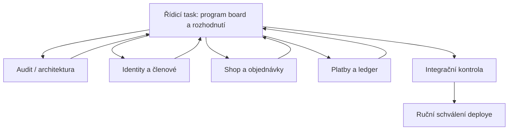

# 05 – Řízení vláken

## Provozní model

Jeden **řídicí task** drží celkový plán a rozhodnutí. Pracovní tasky dostávají
malý, uzavřený úkol a vracejí důkaz. Řídicí task sám rozhoduje o pořadí, kontroluje
kolize, skládá výsledky a teprve potom připraví release.



GitHub Actions zůstává release mechanismus, nikoliv řídicí task. Sloučení do
`main` automaticky neznamená souhlas s produkčním nasazením; workflow se spouští
ručně odpovědnou osobou.

## Povinné artefakty řídicího tasku

Řídicí task udržuje v této složce:

- roadmapu a stav bran,
- rozhodovací log D-001 až D-020,
- tabulku aktivních úkolů: vlastník, branch, soubory/tabulky, závislost, stav,
- migrační pořadí,
- integrační a release report.

Žádný pracovní task nesmí vytvořit vlastní konkurenční architekturu nebo změnit
význam sdíleného stavu bez nového rozhodnutí v logu.

## Git a pracovní prostor

1. Před startem se ověří `git status`, `HEAD` a `origin/main`.
2. Současný lokální rozpracovaný deploy se nejprve bezpečně sjednotí; nic se
   nemaže ani nepřepisuje naslepo.
3. Každý úkol má větev `codex/<kratky-nazev>` z potvrzeného stejného base SHA.
4. Pracovní task smí upravovat jen výslovně přidělené soubory a tabulky.
5. Stage probíhá jmenovitě; nepoužívat plošné `git add -A`.
6. Žádný force push, rebase sdílené větve ani přímý zápis do produkční DB.
7. Kolize ve společném souboru nebo migraci znamená STOP a návrat řídicímu tasku.
8. Každý commit je malý, vratný a má test stejného kontraktu.

## Soubory a oblasti s jediným vlastníkem

Tyto povrchy se nesmějí editovat paralelně:

- migrační runner, migrační ledger a pořadí migrací,
- základ identity, session a autorizace,
- money typy, payment state machine a wallet invarianty,
- společný outbox/audit,
- deploy workflow a produkční runbook,
- centrální rozhodovací log.

Řídicí task jim přiřadí jednoho integračního vlastníka. Ostatní tasky používají
schválené rozhraní nebo připraví samostatný návrh bez zásahu do sdíleného souboru.

## Doporučené vlny práce

### Vlna 0 – pouze odstranění blokátorů

- W0-A: bezpečně sjednotit lokální a vzdálený deploy track,
- W0-B: opravit a otestovat KIS matcher,
- W0-C: dependency/security hardening,
- W0-D: test harness a CI,
- W0-E: číslované migrace, backup/restore a deploy hardening,
- W0-F: uzavřít ADR identity, peněz a KIS ownership.

Sdílené soubory určují, které úkoly mohou běžet souběžně. První sjednocení Gitu
a návrh migračního runneru mají jednoho vlastníka.

### Vlna 1 – vertikály na společném základu

- identity + rodič/dítě,
- členský model + KIS parity,
- bezplatná klubová akce,
- shop katalog + import dry-run.

### Vlna 2 – peníze

- objednávka + bankovní převod,
- reward ledger,
- placená klubová akce,
- Stripe a Fio až po stabilních společných kontraktech.

### Vlna 3 – provoz a cutover

- Packeta,
- reconciliation/observabilita,
- Shoptet cutover,
- samostatně a později KIS cutover.

## Šablona zadání pro pracovní task

```text
CÍL
Jedna věta popisující konkrétní ověřitelný výsledek.

BASE A VĚTEV
Base SHA: <sha>
Větev: codex/<nazev>

POVOLENÝ ROZSAH
Repo, jmenované soubory/adresáře, tabulky a endpointy.

ZAKÁZANÝ ROZSAH
Sdílené soubory a funkce, které task nesmí měnit.

KONTRAKT
Vstupy, výstupy, stavy, oprávnění, idempotency key a chování při chybě.

MIGRACE
Ano/ne; číslo, preflight, post-check, forward-fix a kompatibilita.

AKCEPTAČNÍ SCÉNÁŘE
Konkrétní happy path, hrany, souběh, bezpečnost a regresní test.

VÝSTUP
Změněné soubory, commit SHA, testy s počty, migrační důkaz, rizika a co zůstalo.

STOP PODMÍNKY
Kolize, nejasné rozhodnutí, nečekané produkční tajemství nebo změna mimo rozsah.
```

## Předávací protokol

Pracovní task nehlásí pouze „hotovo“. Vrátí:

1. výsledek v jedné větě,
2. přesný base a commit SHA,
3. seznam změněných souborů a migrací,
4. příkazy a výsledky testů,
5. DB/schema a bezpečnostní důkaz podle rizika,
6. známé limity a nenaplněná kritéria,
7. doporučený merge order,
8. potvrzení, že nezasáhl mimo povolený rozsah.

Řídicí task poté provede nezávislou kontrolu diffu, spustí společné testy a ověří
kompatibilitu migrací. Commit lze označit jako integračně přijatý teprve potom.

## Pravidla pro migrace

- Každé číslo migrace rezervuje řídicí task před zahájením práce.
- Dvě aktivní větve nesmí dostat stejné číslo ani měnit stejnou tabulku bez
  výslovného pořadí.
- Finanční a identitní migrace mají samostatný review.
- Destruktivní změny probíhají expand/contract přes více releasů.
- Pracovní task nikdy nespouští migraci na produkci.

## První konkrétní start

Řídicí task má nyní zadat jen Vlnu 0. Implementaci e-shopu, Stripe nebo wallet
je předčasné spouštět. Doporučené první tři úkoly jsou:

1. **Repo/deploy reconciliation:** zachovat rozpracované soubory, sjednotit je s
   `origin/main`, opravit backup fail-closed a ověřit restore.
2. **KIS safety:** opravit shrinking-cache chybu, přidat fixture s více lidmi a
   prokázat `matched/new/ambiguous/conflict` bez závislosti na pořadí.
3. **Security/test baseline:** aktualizovat knihovny, vyřešit legacy hesla a
   zavést PHPUnit + CI bez změny produktového chování.

Po jejich integraci řídicí task znovu vyhodnotí Bránu F0. Teprve zelená brána
opravňuje rozdělit F1/F2/F4 do samostatných pracovních tasků.
