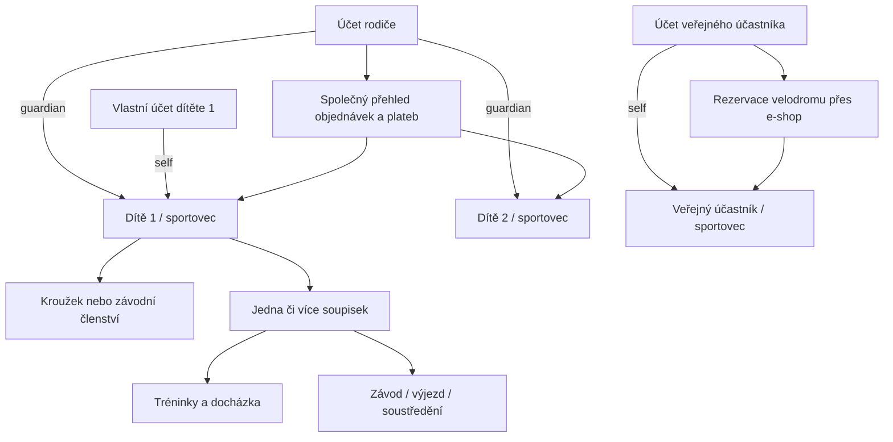
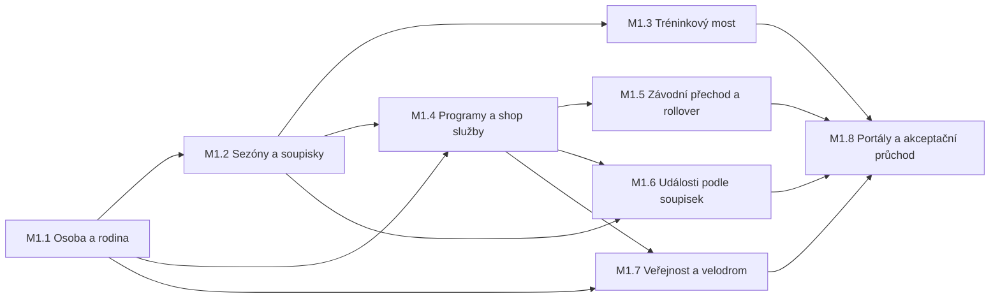

# M1 – Integrovaný a testovatelný prototyp

Stav: kanonický plán prvního produktového milníku

Aktualizováno: 3. 8. 2026

Prostředí milníku: pouze localhost, syntetická testovací data

Produkce, ostrý KIS a Shoptet: bez změny

## Smysl milníku

První milník nemá dokončit všechny automatizace. Má vytvořit jednu soudržnou,
prokliknutelnou aplikaci, ve které vlastník produktu na realistických scénářích
ověří a postupně zpřesní propojení tří oblastí:

1. stávající Evidence tréninků a docházky,
2. e-shopu pro zboží i klubové služby,
3. nové členské evidence nahrazující starý KIS.

M1 je hotový, až lze všechny povinné cesty projít na localhostu jako rodič,
dítě, veřejný účastník a administrátor, změny se projeví ve správné doméně a
každý důležitý přechod má dohledatelný audit. Zpětná vazba z tohoto průchodu je
plánovaný vstup do M2, nikoliv selhání návrhu.

## Produktové hranice M1

### Součást M1

- jeden kanonický profil každého účastníka v `sportovci`, včetně data narození,
- rodičovský účet spravující více dětí a vlastní účet dítěte,
- oddělení objednatele, plátce a účastníka/příjemce služby,
- zboží, košík, kupón, objednávka, osobní odběr a ručně potvrzený převod s QR,
- kroužkové programy s libovolnou délkou účasti,
- kroužkové soupisky organizované podle školního roku,
- závodní členství bez automatického konce a měsíční testovací předpisy,
- závodní soupisky organizované podle kalendářního roku,
- věkové, disciplínové a kroužkové politiky obnovy soupisek,
- řízený přechod sportovce z kroužku do závodního klubu,
- trénink cílený na soupisky a skutečná docházka v existující Evidenci,
- bezplatná i placená událost cílená na jednu nebo více soupisek,
- veřejná registrace a rezervace hodiny velodromu přes e-shop,
- přehled sportovce, rodiče a administrátora,
- bezpečný opakovatelný localhost seed a průvodce testovacími scénáři.

### Záměrně až po M1

- automatická synchronizace s Fio,
- Stripe, Packeta a jiné externí služby,
- Excel a jiné provozní exporty,
- čerpání peněžního nebo odměnového kreditu,
- automatická synchronizace TrainingPeaks; M1 může pouze evidovat identifikátor
  a stav budoucího propojení,
- ostrý import nebo souběžná synchronizace starého KIS,
- ostrý import Shoptetu a vypnutí starých systémů,
- produkční deploy nových produktových funkcí.

Bankovní převod v M1 je testovatelný lokálním QR předpisem a ručním potvrzením.
Automatizace banky není podmínkou ověření obchodního toku.

## Vlastnictví dat a integrační kontrakt

| Oblast | Vlastní zdroj pravdy | Předává ostatním |
|---|---|---|
| Osoba a rodina | `sportovci`, účty a schválené vazby `self`/`guardian` | oprávněné osoby pro objednávku, přihlášku a profil |
| KIS/členská evidence | programy, členství, sezóny, soupisky, licence | oprávnění k tréninku a události, finanční účel |
| Stávající Evidence | tréninky a skutečná docházka | historii sportovce a později podklad pro kredit |
| E-shop | nabídky, košík, objednávky, cenový snapshot a sklad | potvrzené pořízení služby nebo zboží |
| Platby | předpis, metoda a stav platby | potvrzení úhrady; nikdy přímo nemaže člena soupisky |
| Klubové události | cílení, kapacita, přihlášky, čekání a storno | potvrzenou účast a případný platební účel |
| Rezervace | zdroj, časový slot, účastníci a stav | blokaci velodromu a skutečnou účast |

Jedna fyzická osoba nesmí vzniknout znovu při přechodu mezi kroužkem, závodním
klubem a veřejnou rezervací. Samotná existence v `sportovci` neznamená členství
v klubu.

## Sezóny, skupiny a soupisky

Stabilní definice skupiny a její soupiska pro konkrétní období jsou dvě různé
věci. Současný model se rozšíří následovně:

- `club_team_series` – stabilní skupina, například U15 nebo Dráhová cyklistika,
- `club_seasons` – období typu `school_year` nebo `calendar_year`,
- `club_teams` – konkrétní roční soupiska stabilní skupiny,
- `club_roster_members` – časově platné M:N členství sportovce na soupisce.

Každá stabilní skupina má jednu politiku rolloveru:

| Politika | Příklad | Chování při nové sezóně |
|---|---|---|
| `renewal_required` | kroužek | člen se převede jen podle platné účasti/prodloužení |
| `age_progression` | U13 → U15 → U17 | 1. ledna se uzavře staré a založí cílové členství |
| `carry_forward` | dráha, silnice | vznikne nová roční soupiska stejné skupiny a člen se přenese |
| `manual` | výběr nebo speciální družstvo | bez automatické změny |

Kroužková služba může trvat libovolně. Pokud překročí hranici školního roku,
účast zůstane jedna, ale členství na soupisce se rozdělí mezi dvě období.
Závodní členství může být bez konce, i když jeho soupisky jsou vždy roční.

Automatický věkový přesun musí mít prosincový preview, individuální výjimku,
audit a idempotentní provedení k 1. lednu. Nesmí změnit disciplínové soupisky.

## Cílový uživatelský model

Dítě vidí pouze své sportovní a finanční údaje. Rodič vidí konsolidovaný přehled
všech spravovaných dětí. Nákup fyzického zboží bez příjemce zůstává pouze u
objednatele; členská, událostní a rezervační položka má vždy konkrétního
účastníka.

## Implementační proudy a pořadí

### M1.1 – Osoba, rodina a finanční příjemce

Výstupy:

- jeden rodič se dvěma dětmi a dítě s vlastním účtem,
- autorizace `self` a `guardian` pro čtení i mutace,
- příjemce na objednávkové/službové položce,
- dotazy pro rodičovský souhrn a osobní přehled dítěte,
- profilová úplnost včetně povinného data narození.

Brána: rodič vidí obě děti, dítě pouze sebe, cizí účet nic; platba rodiče za dítě
je vidět rodiči i tomuto dítěti, nikoliv sourozenci.

### M1.2 – Dvě sezónní soustavy a politiky soupisek

Výstupy:

- stabilní skupiny a školní/kalendářní sezóny,
- roční instance soupisek a historické členství,
- politiky `renewal_required`, `age_progression`, `carry_forward`, `manual`,
- mapování na existující `skupiny`/`podskupiny`, aby nevznikly dvě nezávislé
  evidence tréninkových skupin.

Brána: jeden sportovec může být současně ve věkové i disciplínové soupisce a
historie předchozí sezóny zůstává čitelná.

### M1.3 – Most do stávající Evidence tréninků

Výstupy:

- výběr jedné či více nových soupisek při založení/plánování tréninku,
- předvyplnění očekávaných účastníků ze soupisek,
- skutečná docházka nadále v existujících tabulkách Evidence,
- zobrazení vlastních tréninků dítěti a rodiči v oprávněném rozsahu.

Brána: administrátor založí trénink pro soupisku, zapíše účast a dítě i rodič
vidí správný výsledek bez zdvojení sportovce.

### M1.4 – Kroužkové programy a služby nakupované e-shopem

Výstupy:

- program, nabízené období, účast a její stav,
- nákup pro konkrétní dítě a prodloužení z profilu,
- oddělený stav objednávky, platby, účasti a soupisky,
- aktivace účasti až po povoleném potvrzení bezplatné nebo uhrazené nabídky,
- přiřazení do školní soupisky podle platnosti služby.

Brána: rodič koupí kroužek jednomu dítěti, druhému se nic nezmění; ruční potvrzení
platby aktivuje účast právě jednou a prodloužení nepřepíše historii.

### M1.5 – Závodní členství, přechod a roční rollover

Výstupy:

- závodní členství s otevřeným koncem a testovacími měsíčními předpisy,
- průvodce přechodem z kroužku bez založení nové osoby,
- návrh věkové soupisky podle konfigurovaných pravidel,
- preview a simulované provedení rolloveru k 1. lednu,
- přenesení disciplínových soupisek a individuální výjimka,
- připravenost profilu na budoucí licenci; licence jako samostatná historie.

Brána: U13 přejde do U15, dráhová soupiska zůstane zachována, opakované spuštění
nic nezdvojí a každý přesun je auditovaný.

### M1.6 – Události cílené na soupisky

Výstupy:

- M:N cílení události na jednu nebo více soupisek,
- jedna přihláška i při oprávnění přes několik soupisek,
- snapshot důvodu oprávnění,
- bezplatný a ručně potvrzený placený scénář,
- existující kapacita, čekací listina, souhlasy a storno.

Brána: rodič přihlásí oprávněné dítě, neoprávněné dítě systém odmítne; poslední
místo a čekací listina zůstanou transakční.

### M1.7 – Veřejný účastník a rezervace velodromu

Výstupy:

- vytvoření účtu a profilu `sportovci` přímo v nákupním toku,
- povinné jméno, datum narození a schválené kontaktní údaje,
- rezervovatelný zdroj, časový slot, kapacita/výhradnost a účastníci,
- transakční ochrana proti dvojí rezervaci,
- objednávka a ručně potvrzená platba,
- skutečná účast propojená se stejným profilem.

Brána: nový dospělý bez klubového členství rezervuje hodinu, vznikne právě jeden
profil a stejný člověk může být později převeden do programu nebo licenčního
procesu bez nové osoby.

### M1.8 – Integrované portály a akceptační průchod

Výstupy:

- rodičovská domovská stránka: děti, programy, události, platby a objednávky,
- dětská/sportovní stránka: vlastní tréninky, soupisky, události a platby,
- administrátorská stránka: lidé, programy, soupisky, neuhrazené položky a audit,
- stránka „Testovací scénáře“ s odkazy, očekávaným výsledkem a možností bezpečně
  obnovit localhost demo,
- aktualizovaný uživatelský manuál.

Brána: vlastník produktu projde povinnou matici bez použití databáze nebo CLI a
ke každému scénáři dokáže zaznamenat připomínku pro M2.

## Povinná localhost testovací sada

Seed musí být opakovatelný, smí běžet pouze při `APP_HOST=localhost` a vytvoří:

- rodiče se dvěma dětmi,
- vlastní účet jednoho dítěte,
- veřejného dospělého účastníka,
- kroužek s kratší účastí uvnitř školního roku,
- věkovou řadu alespoň U13 → U15 → U17,
- disciplínové soupisky dráha a silnice,
- závodníka, který se při simulaci 1. ledna věkově přesune,
- závodníka s výjimkou z automatického přesunu,
- trénink s docházkou,
- bezplatnou a placenou událost cílenou na více soupisek,
- zboží skladem, kupón a dokončenou objednávku,
- volný i obsazený slot velodromu,
- uhrazený, neuhrazený a stornovaný předpis.

Testovací finanční údaje musí být zřetelně označené `NEPLATIT`. Reset nesmí
mazat legacy testovací data, která seed nevlastní.

## Akceptační prohlídka M1

| ID | Role | Cesta | Očekávaný výsledek |
|---|---|---|---|
| A01 | rodič | přihlášení → moje děti | dvě děti, žádná cizí osoba |
| A02 | dítě | vlastní přihlášení → profil | jen vlastní tréninky, platby a soupisky |
| A03 | rodič | e-shop → kroužek → dítě 1 → QR | objednávka patří rodiči, služba dítěti 1 |
| A04 | admin | ruční úhrada | jedna aktivní účast a správná školní soupiska |
| A05 | admin | přechod kroužek → závodní tým | stejný sportovec, závodní členství a věková soupiska |
| A06 | admin | simulace 1. ledna | věkový přesun, disciplína přenesena, výjimka zachována |
| A07 | trenér | trénink pro soupisku → docházka | správní očekávaní a skuteční účastníci |
| A08 | rodič | událost pro dvě soupisky | právě jedna přihláška oprávněného dítěte |
| A09 | veřejnost | registrace → profil → slot velodromu | jeden profil, rezervace a objednávka |
| A10 | admin | audit osoby/objednávky/soupisky | dohledatelné kdo, kdy, co a proč |

Připomínky z ručního průchodu se zapisují jednotně: ID scénáře, použitá role,
pozorované chování, očekávané chování a důležitost `blokuje / důležité / námět`.
Blokující chyba se opravuje v M1; změna pravidla nebo nový nápad jde nejprve do
produktového rozhodnutí a teprve potom do M1 či M2.

## Testovací pyramida a brány každého přírůstku

Každý přírůstek musí dodat:

1. unit test pravidla a oprávnění,
2. SQLite integrační test stavového přechodu,
3. MariaDB test migrace a rizikových transakcí/zámků,
4. PHP lint změněných a nakonec všech first-party souborů,
5. plný PHPUnit běh bez regrese,
6. localhost browser smoke příslušné cesty,
7. aktualizaci scénáře, dokumentace a handoffu.

Časově citlivé procesy nesmí záviset na skutečném dnešním datu. Rollover a
expirace používají injektovatelný testovací čas. Souběh posledního místa,
dvojité rezervace a dvojitého potvrzení platby se ověřuje skutečnými souběžnými
MariaDB procesy.

## Definition of Done M1

- [ ] všech deset akceptačních cest A01–A10 lze projít v UI,
- [ ] všechny účastnické cesty používají stejnou osobu v `sportovci`,
- [ ] rodič–dítě a dítě–vlastní účet mají otestované IDOR hranice,
- [x] školní a kalendářní sezóny fungují současně na localhostu,
- [ ] všechny čtyři politiky soupisek mají auditovaný test,
- [ ] tréninková Evidence používá nové soupisky bez druhého ručního seznamu,
- [ ] objednatel, plátce a příjemce jsou na všech službách rozlišitelní,
- [ ] kroužek, přechod do závodního klubu, událost a velodrom mají E2E důkaz,
- [ ] fresh localhost setup, migrace a seed jsou opakovatelné,
- [ ] plná testovací sada, dependency audit a migration check jsou zelené,
- [ ] produkce, Fio, Stripe, Shoptet a starý KIS nebyly změněny,
- [ ] vlastník produktu provedl průchod a připomínky jsou zařazené do M2.

## Orientační mapa současného stavu

Procenta jsou odhad pokrytí akceptačních cest M1, nikoliv množství kódu.

| Proud | Stav po M1.8 akceptačním přírůstku | Hlavní mezera |
|---|---:|---|
| stávající tréninková Evidence | 92 % | dotažení zápisu skutečné docházky a produktová prohlídka |
| účty, rodič a osoby | 94 % | self-service obnova hesla sportovce a produktová prohlídka oprávnění |
| běžné zboží a objednávka | 93 % | produkční UX a pravidlo kupónů pro služby |
| programy/kroužky | 86 % | celý vlastníkům provedený A03–A04 průchod a produktová kontrola textů |
| sezóny a soupisky | 91 % | vlastníkovo provedení A05 nad kopií dat a doladění administračního UX |
| události a přihlášky | 78 % | placený scénář a UX validace časové platnosti soupisky |
| veřejnost a velodrom přes e-shop | 94 % | rozhodnutí, zda kupóny platí na sloty, a produktová prohlídka |
| integrovaný demo průchod | 94 % | vlastníkova prohlídka A01–A10 a zapracování připomínek |

Celý M1 je po M1.9 provozním přírůstku přibližně na 90 %. E-shopový základ,
rodinný rozsah, soupisky, plánování tréninku, kroužkové nabídky, cílené události,
automatický životní cyklus programové účasti, provedení rolloveru a veřejná
rezervace mají integrované localhost řezy. Přibyly A01–A10 rozcestník, omezený
sportovní login a shop objednávka s QR pro placený velodrom. M1.9 doplnilo
preview-first průvodce A05, jednotnou read-only auditní osu A10 a bezpečnou expiraci
nezaplacených objednávek přes stejný storno lifecycle. Největší mezera je nyní
vlastníkova ruční prohlídka A01–A10 a zapracování jejích výsledků.

## Co následuje po M1

Připomínky z akceptační prohlídky se roztřídí na chyby M1, UX úpravy a nové
požadavky M2. Teprve poté se zvolí pořadí kreditu, automatických plateb,
TrainingPeaks, exportů a ostré migrace. Ostrý cutover starého KIS a Shoptetu má
samostatný plán: finální export, dry-run, řešení konfliktů, záloha, jednorázový
promote, paritní kontrola a přepnutí starých systémů do režimu pouze pro čtení.
